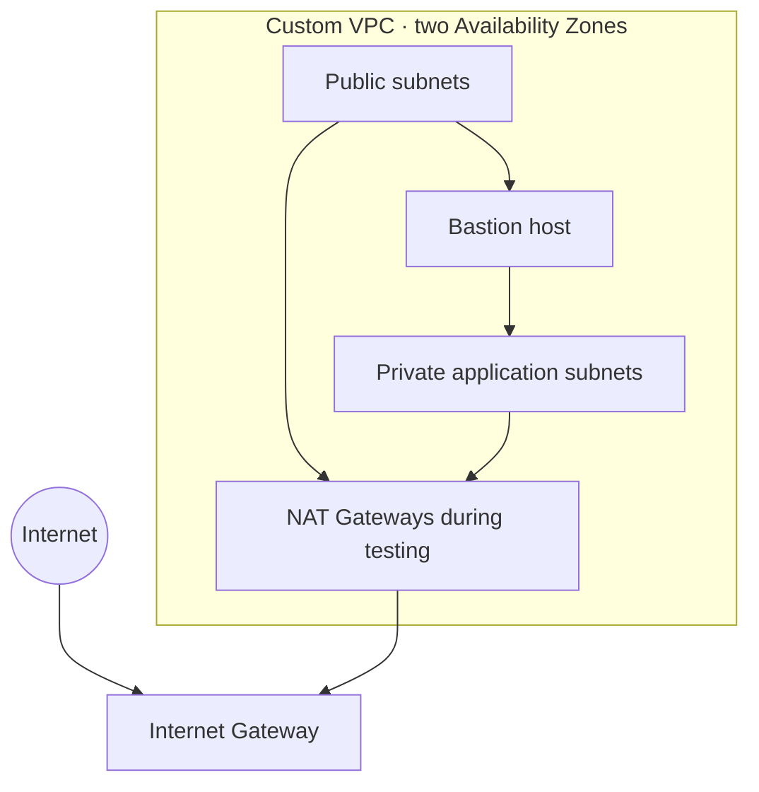

# AWS Cloud & Security Portfolio

A practical AWS networking and cloud-security lab demonstrating how to design, secure, validate, and document a small multi-AZ environment.

## Project at a glance

| Area | What this lab demonstrates |
| --- | --- |
| Networking | Custom VPC, public and private subnets, route tables, Internet Gateway, and NAT egress |
| Compute access | Bastion-mediated SSH to private EC2 instances |
| Security | Security Groups, IAM fundamentals, least privilege, CloudTrail, and VPC Flow Logs |
| Operations | Connectivity testing, traffic interpretation, and cost-aware teardown |

## Architecture



Private application instances have no public IP addresses. Administrative SSH access passes through the bastion host, while NAT Gateways provided temporary outbound connectivity during testing.

## Documentation

- [VPC networking module](02-networking/01-vpc/README.md) — design, access controls, tests, and lessons learned.
- [Evidence guide](docs/evidence.md) — how to add screenshots safely.
- [Portfolio hygiene guide](docs/portfolio-hygiene.md) — what must never be committed.

## Repository layout

```text
.
├── README.md
├── 02-networking/
│   └── 01-vpc/                 # Completed VPC implementation
│       └── README.md
├── docs/                       # Supporting portfolio documentation
│   ├── evidence.md
│   └── portfolio-hygiene.md
└── .gitignore
```

## Validation performed

- Verified private-instance outbound HTTPS through NAT during the active test window.
- Confirmed private-to-private connectivity after correcting the applicable network controls.
- Verified routing from each instance with `ip route`.
- Enabled CloudTrail and VPC Flow Logs to support audit and network investigation.

## Security and cost notes

- No private application instance was directly reachable from the public internet.
- Security Groups were used as stateful access controls; application SSH was restricted to the bastion path.
- NAT Gateways were deleted after validation to avoid ongoing charges.
- This repository intentionally omits live account IDs, resource IDs, public IPs, exported logs, credentials, and private keys.

## Status

**In progress.** The VPC, subnets, routing, bastion access, EC2 validation, CloudTrail, and Flow Logs are complete. Planned work includes a practical IAM-role exercise, Terraform implementation, monitoring, and security-service extensions.

## Skills demonstrated

AWS VPC · EC2 · subnetting · CIDR · routing · NAT · Internet Gateway · Security Groups · SSH · IAM · CloudTrail · VPC Flow Logs · Linux troubleshooting · cloud cost awareness

## Author

Ayoub Boudouh  
Network Administration & Security · Cloud Security · Network Security · DevSecOps
