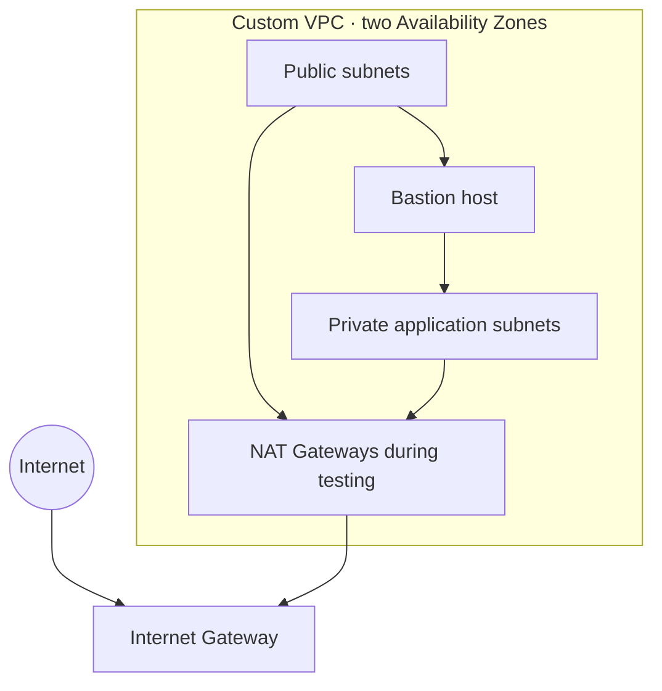

# AWS Cloud & Security Portfolio

A practical AWS networking and cloud-security portfolio built from hands-on AWS labs. This repository documents the design decisions, validation work, and security controls behind a multi-AZ VPC environment.

## Featured project: multi-AZ VPC

A private application environment spanning two Availability Zones, built with public and private subnet tiers, a bastion host for administration, NAT egress during validation, and AWS-native logging.



### What I implemented

- Designed a VPC across two Availability Zones with separate public and private subnet tiers.
- Kept application instances private and used a bastion host for controlled SSH administration.
- Configured route tables, an Internet Gateway, Security Groups, and temporary NAT egress.
- Validated private egress, routing, and east-west connectivity from Linux hosts.
- Enabled CloudTrail and VPC Flow Logs to support audit and network investigation.
- Enabled AWS Config to evaluate a Security Group against a restricted-SSH rule and verified remediation.
- Generated and analyzed GuardDuty sample findings to practice a detection and investigation workflow.
- Deleted temporary NAT Gateways and stopped test instances to control costs.

### Explore the project

- [Networking module](02-networking/README.md)
- [VPC design and validation](02-networking/01-vpc/README.md)
- [Observability](03-observability/README.md)
- [Cloud security](04-cloud-security/README.md)

## Repository layout

```text
.
├── 02-networking/             # VPC implementation and validation
├── 03-observability/          # CloudTrail and VPC Flow Logs
├── 04-cloud-security/         # AWS Config and GuardDuty
└── .gitignore
```

## Skills demonstrated

AWS VPC · EC2 · subnetting · CIDR · routing · NAT · Internet Gateway · Security Groups · SSH · IAM · CloudTrail · VPC Flow Logs · AWS Config · GuardDuty · Linux troubleshooting · cloud cost awareness

## Current status

The VPC networking, logging, AWS Config, and GuardDuty labs are complete. Next steps are a practical IAM-role exercise, Terraform implementation, CloudWatch alerting, and EventBridge/SNS integration for GuardDuty findings.

## Author

Ayoub Boudouh  
Network Administration & Security · Cloud Security · Network Security · DevSecOps
